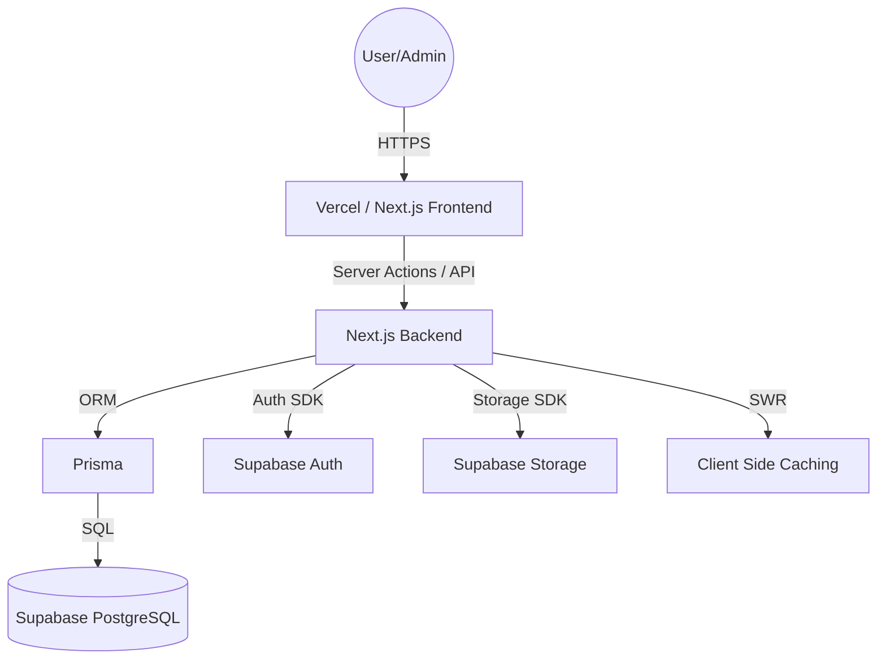

# Design Documentation: Saral Sahayta

## 1. System Architecture
Saral Sahayta follows a modern Full-Stack Web Architecture using **Next.js 14** as the core framework.

### 1.1 High-Level Diagram (Conceptual)

## 2. Frontend Design

### 2.1 Design Language
- **Aesthetics**: Premium Glassmorphism (backdrop-blur, translucent layers, subtle gradients).
- **Typography**: Inter (Sans-serif) for high readability across languages.
- **Components**: Built on **Radix UI** primitives for accessibility and **Lucide React** for consistent iconography.
- **Animations**: Driven by **Framer Motion** for smooth transitions and state changes.

### 2.2 Layout Strategy
- **Root Layout**: Global configuration, Navbar, and Providers (Auth, SWR).
- **Dashboard Layout**: Shared shell for authenticated users, focusing on profile/applications.
- **Admin Layout**: Enterprise-grade sidebar navigation for high-density data management.

## 3. Backend & Data Layer

### 3.1 Authentication
- **Provider**: Supabase Auth.
- **Flow**: Session-based auth with middleware-level protection for sensitive routes (`/admin/*`, `/dashboard/*`).
- **Authorization**: Role-based access control (RBAC) via the `is_admin` flag in the user profile.

### 3.2 Data Modeling (Prisma)
- **User/Profile**: Centralized identity and socio-economic data.
- **Scheme**: Document-like structure stored in SQL for fast matching.
- **Application**: Join table tracking the relationship between Users and Schemes.
- **Document**: Metadata for files stored in Supabase Storage.

### 3.3 API Design
- **RESTful Routes**: standard Next.js API routes (`/api/admin/...`, `/api/applications/...`).
- **Dynamic Rendering**: `force-dynamic` used for real-time status updates and personalized matching.
- **Caching**: `useSWR` for efficient client-side data fetching and revalidation.

## 4. UI/UX Principles
- **Clutter-Free**: High data density in admin areas, but simple/clean interfaces for citizens.
- **Status-Driven**: Clear visual indicators for application/verification stages.
- **Trust-Oriented**: Focus on security badges, encrypted data handling, and official branding.

## 5. Deployment & DevOps
- **Hosting**: Vercel (Production) / Local (Development).
- **CI/CD**: Automated deployments via GitHub integration.
- **Database**: Managed PostgreSQL on Supabase with Prisma Migrations.
